# 🔥 Fuel Tracker – Generator Monitoring App

Welcome to **Fuel Tracker**, a mobile app designed to monitor and manage the **fuel usage, runtime, and efficiency of generators** in a smart, simple and elegant way.

> 📱 Built with Flutter – designed for speed, clarity, and efficiency.

---

## 📸 Screenshots

<!-- Replace these with your actual image links -->
<p float="left">
  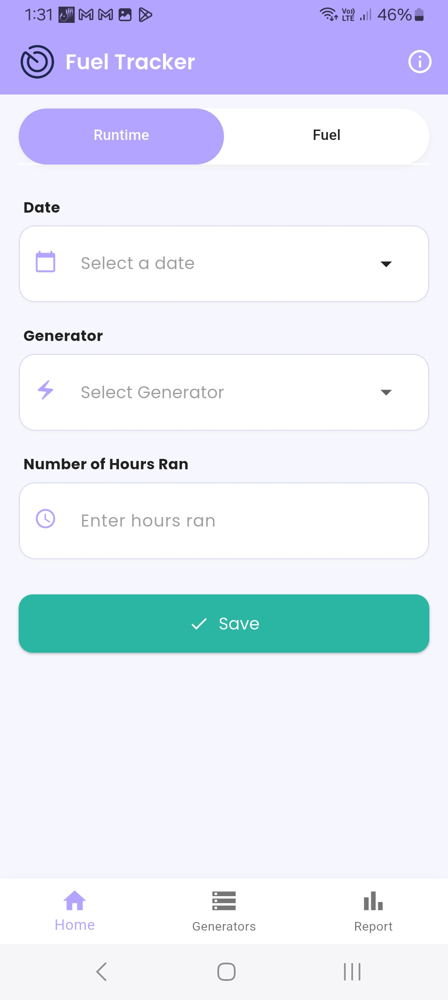
  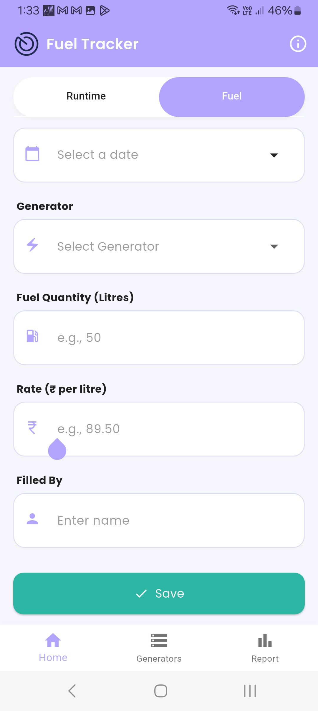
  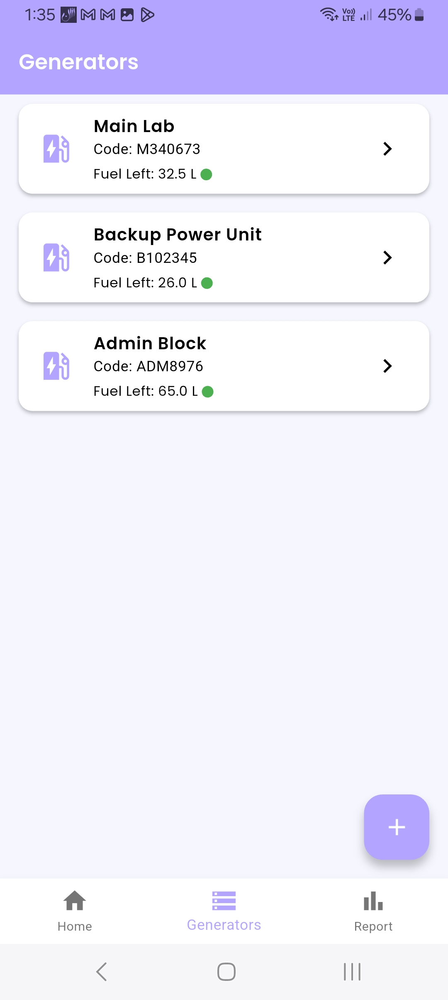
  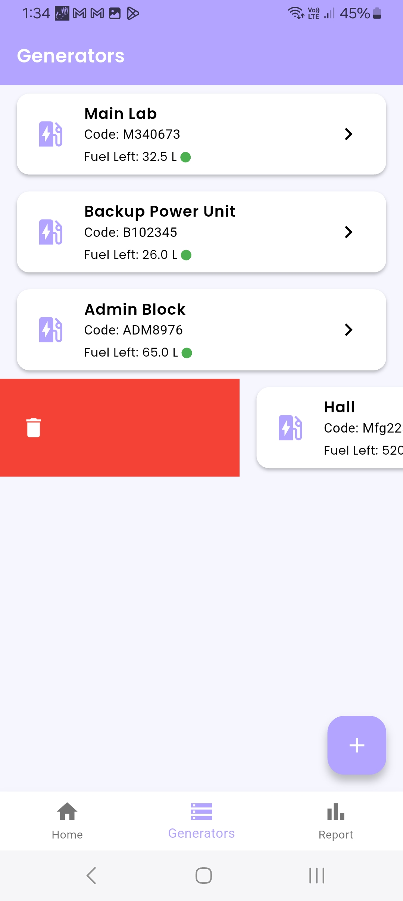
  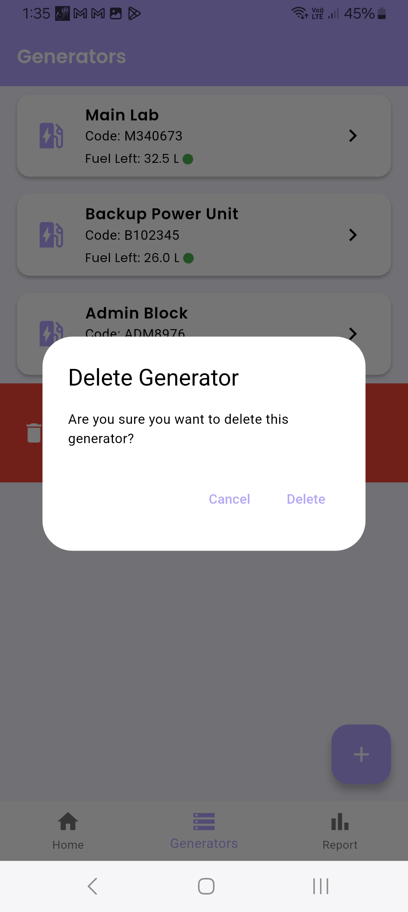
  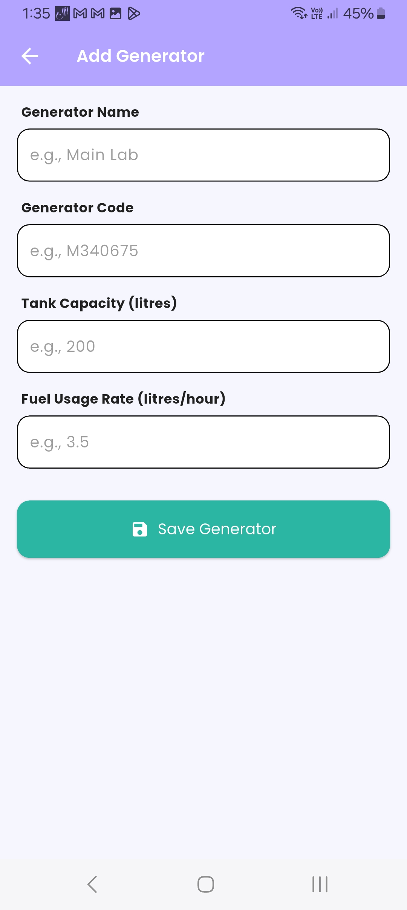
  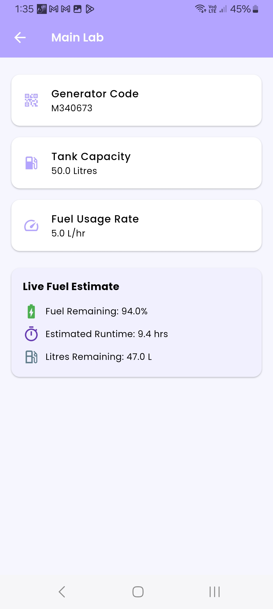
  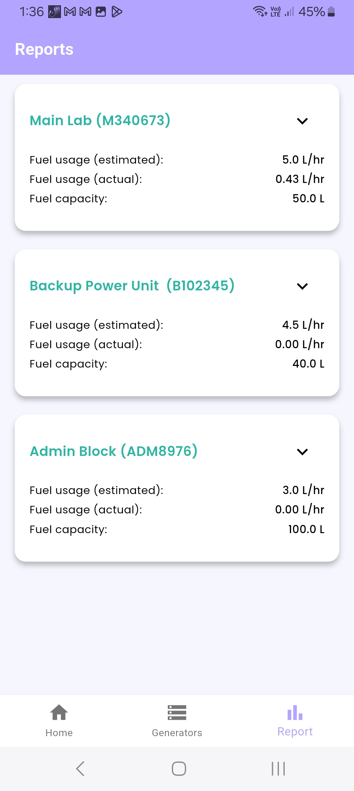
  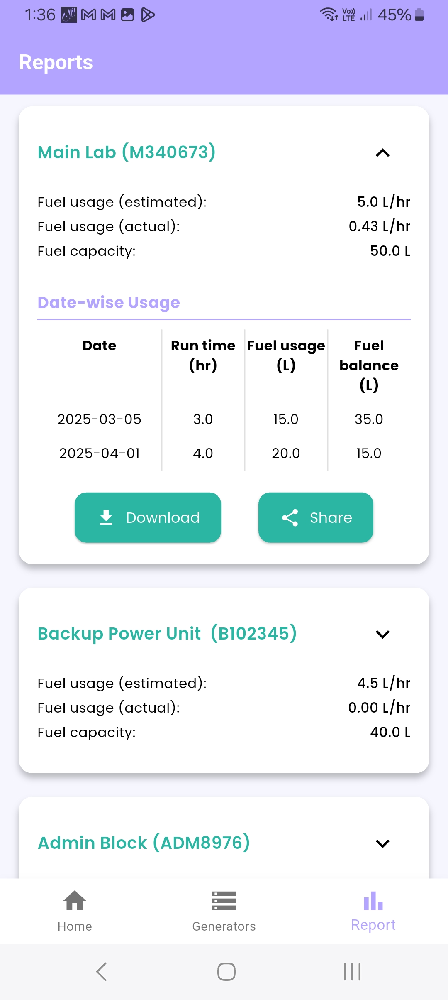
  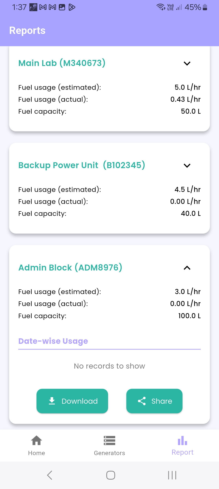
  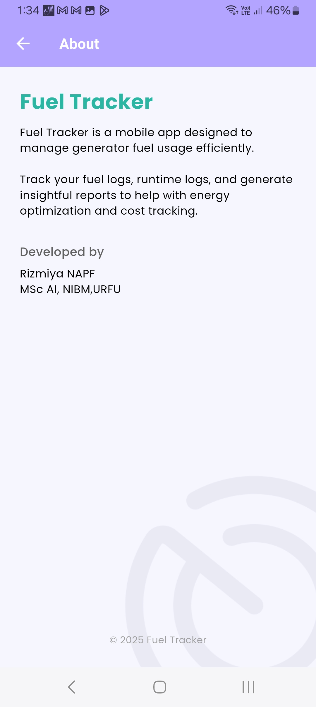
</p>

---

## 🚀 Features

- 📋 Add **runtime entries** per generator with date and hours
- ⛽ Log **fuel refills** with litres, rate, filled by, and date
- ⚙️ Define generator details including:
  - Name & Code
  - Fuel Tank Capacity
  - Estimated Fuel Usage Rate (litres/hour)
- 📊 **Auto-generated reports** per generator:
  - Total runtime and fuel consumption
  - Estimated vs actual fuel usage (L/hr)
  - Fuel balance tracking (date-wise)
- 📤 Export and share reports via:
  - ✅ CSV Download
  - ✅ Share via apps
- 🖼️ Stylish expandable cards with clean UI
- 📎 Offline storage using Hive (lightweight NoSQL database)

---

## 📦 Tech Stack

| Technology           | Purpose                                |
| -------------------- | -------------------------------------- |
| 🧱 **Flutter**       | UI framework for cross-platform apps   |
| 🎨 **Google Fonts**  | Beautiful typography styling           |
| 💾 **Hive**          | Local NoSQL database for storing data  |
| 📂 **Path Provider** | Accessing device storage for downloads |
| 📤 **Share Plus**    | Sharing files to external apps         |
| 📄 **CSV**           | Generating .csv reports                |
| 📅 **Intl**          | Date formatting and localization       |

---

## 🧠 Architecture

- `main.dart`: Initializes Hive boxes and launches the app
- `screens/`: Home tabs (runtime, fuel), generators list, and report UI
- `models/`: Data classes – FuelEntry, RuntimeEntry, Generator
- `components/`: Shared UI widgets (cards, forms, etc.)
- `utils/report_exporter.dart`: Handles CSV creation and sharing logic

---

## 📤 Report Logic

Each report combines data from:

- ✅ Generator details (`Generator`)
- ✅ Runtime logs (`RuntimeEntry`)
- ✅ Fuel entries (`FuelEntry`)

The app calculates:

- ⏳ Total runtime (hours)
- ⛽ Total fuel used (litres)
- 📊 Fuel usage (estimated vs actual)
- 📅 A date-wise table showing:
  - Runtime
  - Fuel used (based on estimated rate)
  - Fuel balance (updated each entry)

> 💾 You can **download** or **share** each report as a CSV file with one tap.

---

## 👩‍💻 Developer Info

Developed by **Rizmiya N.A.P.F.**  
_MSc in Artificial Intelligence – NIBM/Ural Federal University_

---

## 📥 Getting Started

1. 📦 Clone this repo
   ```bash
   git clone https://github.com/your-username/fuel-tracker.git
   ```
2. 📲 Install Flutter dependencies
   ```bash
   flutter pub get
   ```
3. 🚀 Run the app
   ```bash
   flutter run
   ```

## 📘 License

All rights reserved © 2025 Rizmiya N.A.P.F.

Distributed under the MIT License.
